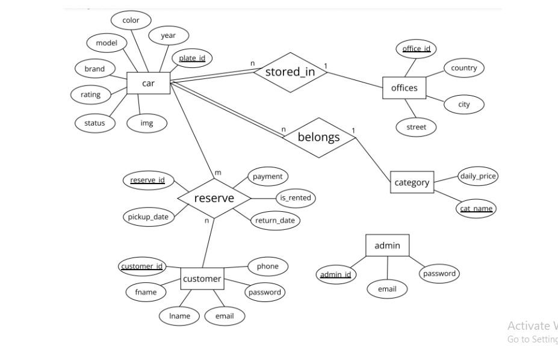
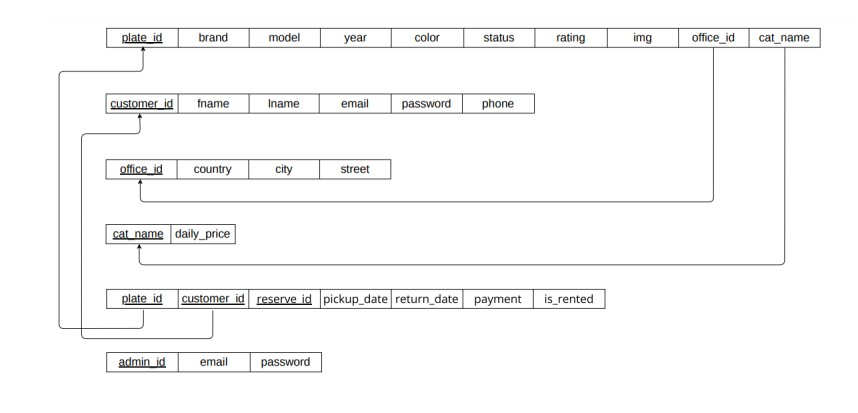
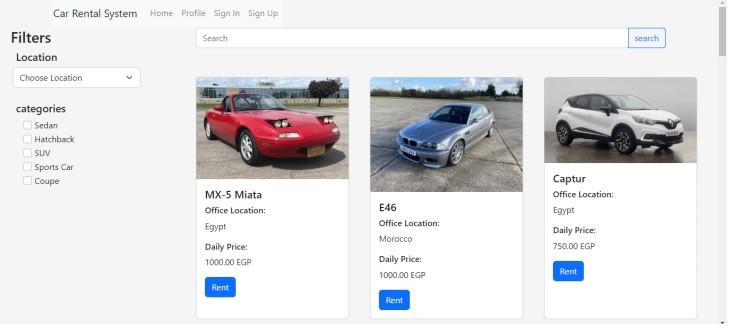
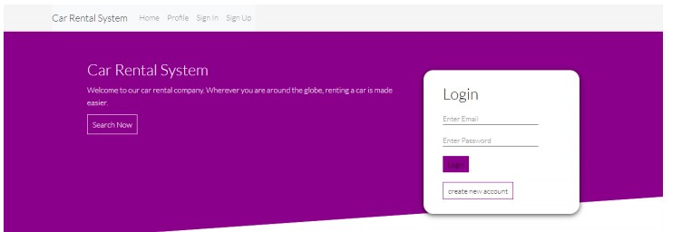
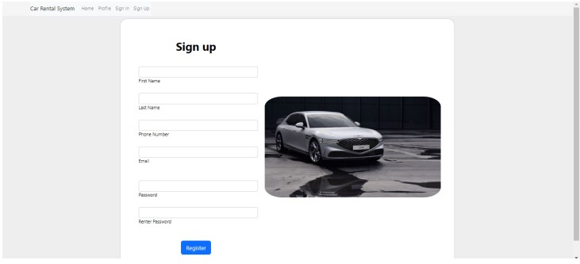
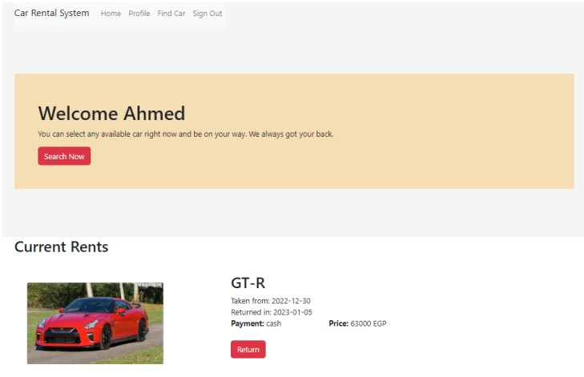
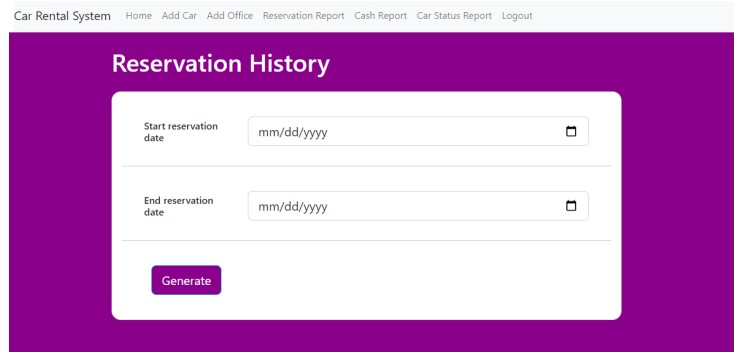

# Car-Rental-System
A project simulating a real life car rental system where a user can search, rent and return a car, and Admin can add offices, cars, as well as other features.

## Entity Relationship Diagram 

## Mapping:

### Implemented Customer Features:
❖ Search
Users may search for cars using either filters or the search bar. The filters contain checkboxes for car categories and a drop-down menu for countries that contain our available office branches. The typing search bar works for the car brand, model, color, price, and location.

❖ Sign in/up
Anyone may utilize the website and search for cars without having an account, however, renting requires it. While signing in/up all validations are available, and customer passwords are encrypted before being saved to the database.

❖ Renting
After finding the desired car, the user simply presses rent on the car’s card. This opens a new page that contains the car’s information, where the user inserts the way of payment, the pickup date, and the return date. Then press reserve and consider the car yours. The customer may rent more than one car at once. Cars that are rented or out of service are hidden from other users.

❖ Profile
When a user enters their profile, they get to see their current rent. Users can quickly return their cars before the return date they chose, which updates the return
date in the database. Each rent also has the full price to be paid for the number of days.

### Implemented Admin Features:
❖ Sign in
There is only one admin email available, so the admin uses the normal sign-in page as the customers, however, in the database his data is saved in a relation alone.

❖ Search
The admin page’s only way of searching is the search bar which is similar to the one on the customer home page. Nevertheless, the admin has three different choices to
search from: cars, offices, and customers.

❖ Cars in admin home page
This page contains all the cars their status, rating, and offices id where they are stored. The admin has two options: edit car and car history. The Edit car button is
needed if the admin wants to manually update the status, rating, or office id of a car, or if the car needed to be removed permanently from the system. Car history contains all reservations of the chosen car within a specified period including all car information.

❖ Offices in admin home page
This page contains all the available offices and their information. The admin may edit the office city or street for relocation purposes, or they may delete it permanently from the system.

❖ Customers in admin home page
All customers and their basic information are available on this page. The admin may request a customer report, which contains all reservations of a specific customer
including their information, car model, and plate id.

❖ Add car
The admin may choose the option add car from the navigation bar. This allows him to insert a new car into the system.

❖ Add office
The admin may choose the option add office from the navigation bar. This allows him to insert a new office branch into the system.

❖ Reservation report
Included in the navigation bar the reservation report retains all reservations within a specified period including all car and customer information.

❖ Cash report
Included in the navigation bar the cash report gets the daily payments within a specific period.

❖ Car status report
The admin may choose car status report from the navigation bar, which retrieves the status of all cars, whether rented or not, on a specific day.

## Sample Screenshots

